<p align="center">
  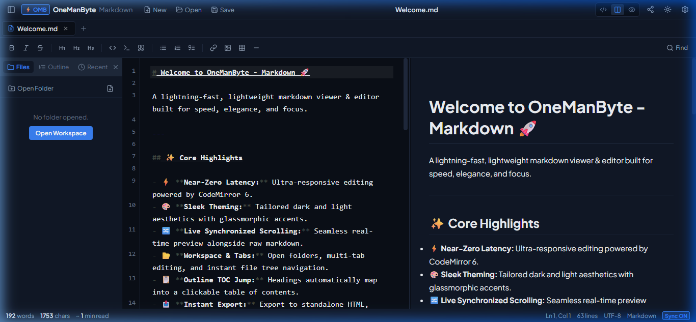
</p>

<h1 align="center">OneManByte — Markdown ⚡</h1>

<p align="center">
  A lightning‑fast, cross‑platform markdown editor built with <strong>Tauri v2</strong>, <strong>Svelte 5</strong>, <strong>CodeMirror 6</strong>, and <strong>markdown‑it</strong>.
  <br/>
  <em>Under 1s startup · Under 100MB RAM · Zero telemetry · Fully offline</em>
</p>

<p align="center">
  <a href="https://github.com/Arslan10227/one-man-byte-markdown/releases"></a>
  <a href="https://github.com/Arslan10227/one-man-byte-markdown/actions"></a>
  
  
</p>

---

## Features

- **Split view** — live-sync editor and preview with proportional scroll
- **Dark & Light themes** — glassmorphic dark slate + crisp light mode
- **Multi-tab workspace** — file tree sidebar, tab bar, recent files panel
- **Outline TOC** — auto-generated, clickable table of contents from headings
- **Formatting toolbar** — bold, italic, headings, code, tables, lists, links
- **Interactive task lists** — clicking checkboxes in preview toggles markdown source
- **Syntax highlighting** — highlight.js code blocks with one-click copy
- **Mermaid diagrams** — flowcharts & sequence diagrams open in a full zoom modal
- **KaTeX math** — inline `$…$` and display `$$…$$` rendering
- **Export** — standalone HTML, PDF print, copy HTML to clipboard
- **`.md` file association** — custom icon with `.MD` badge, double-click to open
- **Save prompt** — never lose unsaved work, prompted on close or tab close
- **Clean uninstall** — removes registry entries and user data on Windows

---

## Screenshots

### Main Editor — Dark Mode
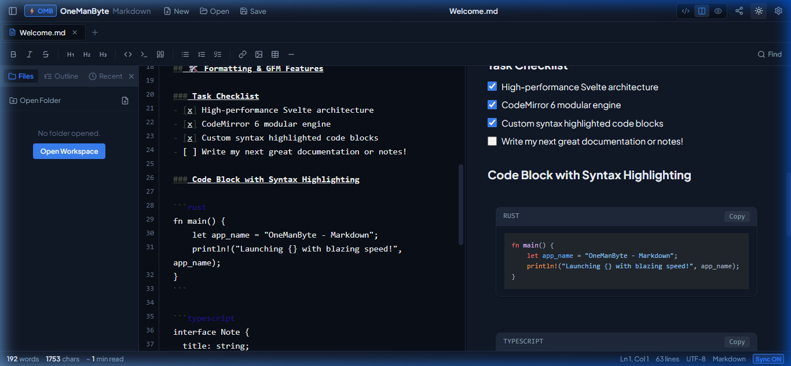

### Main Editor — Light Mode
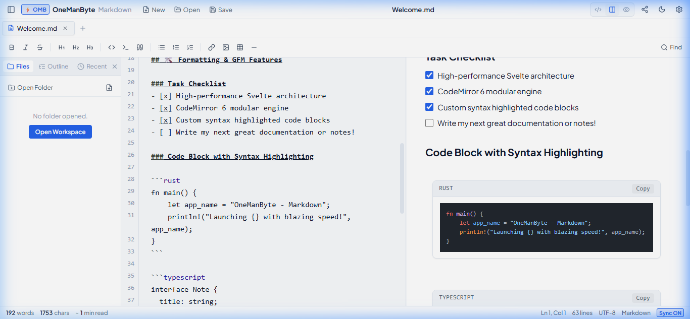

### Outline / TOC Sidebar
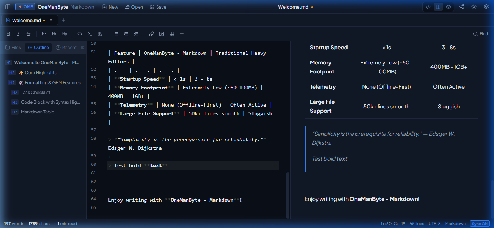

### KaTeX Mathematical Formulas
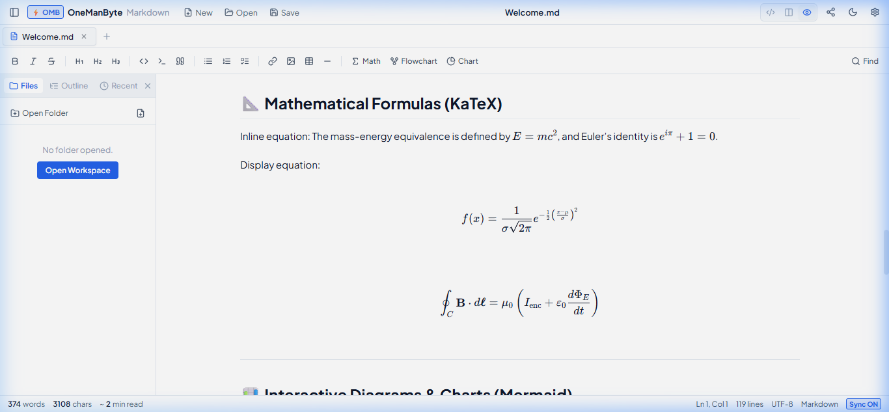

### Mermaid Diagram Modal
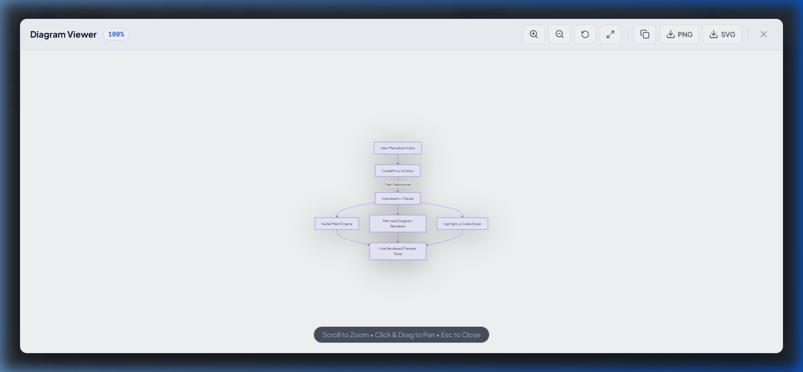

### Diagram Viewer — Zoomed In
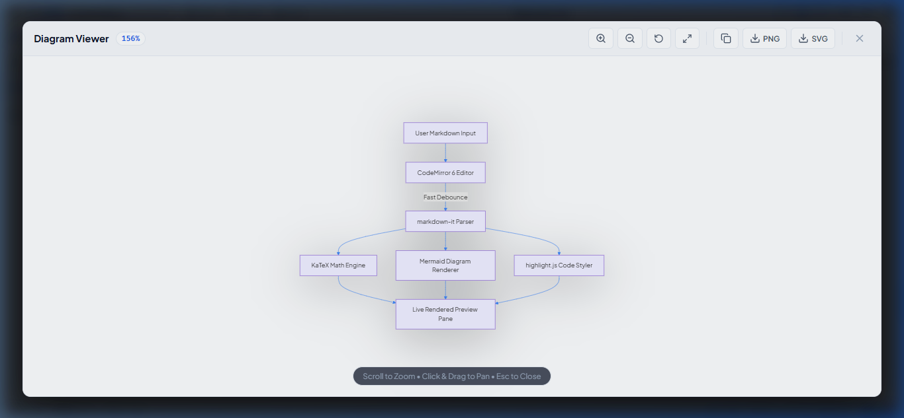

### Preferences & File Association
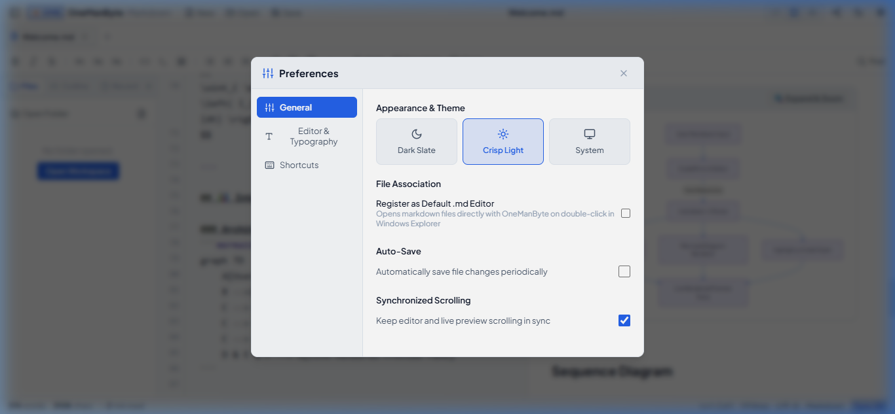

---

## Session Recordings

### Full App Demo
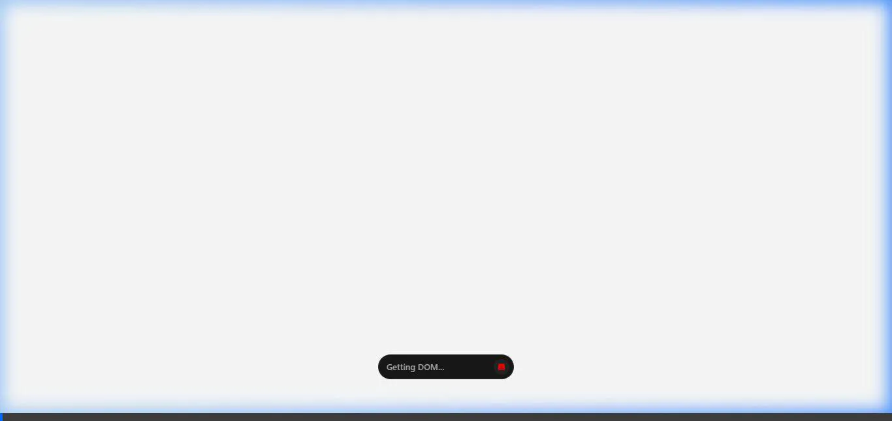

### Math Formulas Demo
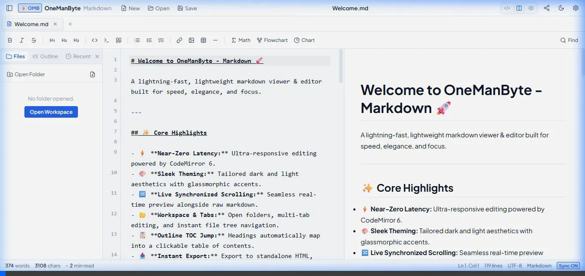

### File Association Settings Demo
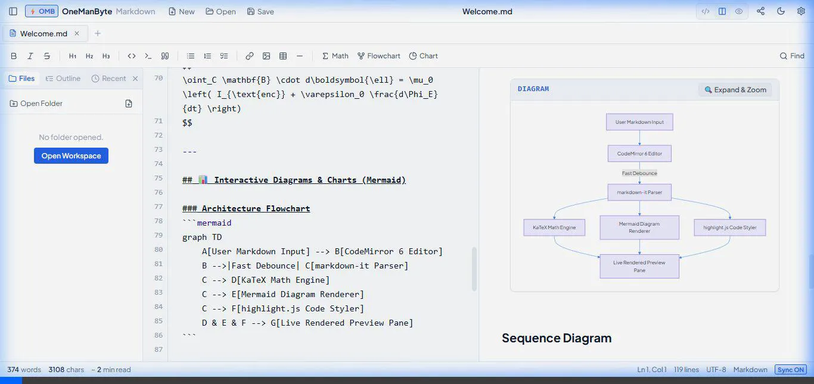

---

## Installation

### Windows
1. Download `OneManByte-Markdown_*_x64-setup.exe` from [Releases](https://github.com/Arslan10227/one-man-byte-markdown/releases).
2. Run the installer — no console window appears.
3. Enable **Register as Default .md Editor** in Settings to open `.md` files by double-click.

### macOS (Universal — Intel & Apple Silicon)
1. Download the `.dmg` from [Releases](https://github.com/Arslan10227/one-man-byte-markdown/releases).
2. Drag the app to `/Applications`.

### Linux
1. Download the `.AppImage` or `.deb` from [Releases](https://github.com/Arslan10227/one-man-byte-markdown/releases).
2. For AppImage: `chmod +x OneManByte*.AppImage && ./OneManByte*.AppImage`

---

## Keyboard Shortcuts

| Shortcut | Action |
|---|---|
| `Ctrl+N` | New file |
| `Ctrl+O` | Open file |
| `Ctrl+S` | Save |
| `Ctrl+Shift+S` | Save as |
| `Ctrl+B` | Toggle sidebar / Bold |
| `Ctrl+I` | Italic |
| `Ctrl+K` | Insert link |
| `Ctrl+F` | Find & replace |
| `Ctrl+,` | Preferences |
| `Escape` | Close diagram modal |

---

## Development

**Prerequisites:** Node.js 18+, Rust stable, Cargo

```bash
# Install dependencies
npm ci

# Run in dev mode (hot-reload)
npm run tauri dev

# Production build
npm run tauri build
```

---

## CI / CD

The workflow in `.github/workflows/build.yml` uses `tauri-apps/tauri-action` to build and publish GitHub Releases for all platforms.

**Trigger a release:**
1. Go to **Actions → Build and Release → Run workflow**
2. Enter a version tag (e.g. `v1.0.1`)
3. The workflow builds Windows, macOS (universal), and Linux binaries and publishes them as a GitHub Release automatically.

Alternatively, push a git tag:
```bash
git tag v1.0.1
git push origin v1.0.1
```

| Platform | Target | Artifacts |
|---|---|---|
| Windows | `x86_64-pc-windows-msvc` | `.exe` installer, `.msi` |
| macOS | Universal (`x86_64` + `arm64`) | `.dmg` |
| Linux | `x86_64-unknown-linux-gnu` | `.AppImage`, `.deb` |

---

## Architecture

```
├── src/                      # Svelte 5 frontend
│   ├── App.svelte            # Root — global keyboard, drag-drop, context menu
│   ├── lib/
│   │   ├── components/       # TitleBar, TabBar, EditorPane, PreviewPane, DiagramModal…
│   │   ├── markdown/         # parser.ts (markdown-it + KaTeX + Mermaid)
│   │   ├── platform/         # fs.ts — Tauri ↔ frontend bridge
│   │   └── stores/           # editorStore.ts, themeStore.ts, toastStore.ts
│   └── main.ts
├── src-tauri/                # Rust backend
│   ├── src/lib.rs            # Tauri commands: file I/O, window, file association
│   ├── icons/                # App icons + md_association_icon.ico
│   └── tauri.conf.json
└── .github/workflows/
    └── build.yml             # Cross-platform CI/CD
```

---

## License

MIT © OneManByte
